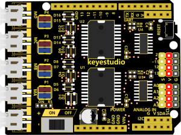
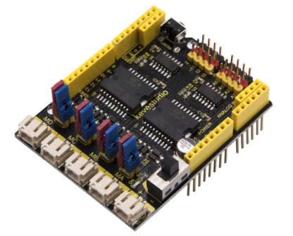
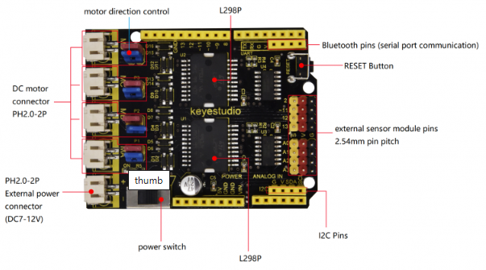
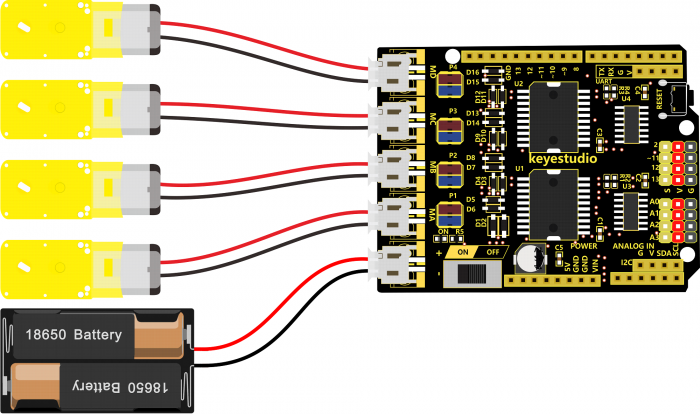
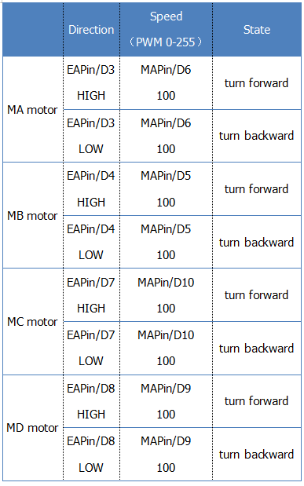

# KS0448 Keyestudio L298P 4-Channel Motor Drive Shield



## 1. Overview

There are many ways to drive the motor. Our robot uses the most commonly used L298P solution.

L298P is an excellent high-power motor driver IC produced by STMicroelectronics. It can directly drive DC motors, two-phase and four-phase stepping motors. The driving current up to 2A, and output terminal of motor adopts eight high-speed Schottky diodes as protection.

We have designed the motor driver shield based on the L298P circuit. The stackable design can make it be plugged directly into the Arduino, reducing the technical difficulty of using and driving the motor.

Direct stack the motor driver shield onto UNO R3 board, after the BAT is powered on, turn the Slide button ON, to supply the power for both keyestudio motor driver shield V2 and UNO R3 board.

For simple wiring, the motor driver shield comes with **anti-reverse PH2.0-2P connectors**. When connecting the motors, just plug in directly. The **Bluetooth interface** on the motor driver shield is fully compatible with keyestudio HM-10 Bluetooth module. When connecting, just plug HM-10 Bluetooth module into the corresponding interface.

At the same time, the motor drive shield has brought out extra digital and analog ports in the form of **2.54mm pin/female headers**, so that you can continue to add other sensors for experiments extension.



The motor drive shield can access to 4 DC motors. And the **8 jumpers can be applied to control the turning direction of 4 motors**.

For instance, if change the 2 jumpers near the motor A connector from horizontal connection to vertical connection, the turning direction of motor A is opposite to the original rotation direction.

The L298P motor drive shield comes with three 3mm fixing holes, easy for mounting on other devices.

## 2. Technical Details

- Logic part input voltage: DC5V
- Driving part input voltage: DC 7-12V
- Logic part working current: <36mA
- Driving part working current: <4A
- Maximum power dissipation: 50W (T=75℃)
- Working temperature: -25℃～＋130℃
- White connector: PH2.0-2P
- Pin/female header pitch: 2.54mm
- Fixing hole diameter: 3mm
- Dimensions: 65mm * 50mm * 30mm
- Weight: 29.1g

## 3. PINOUT Diagram



## 4. Hookup Guide



## 5. Settings Method



## 6. Test Code

Code download:  [Resources](./Resources.7z)

```c
const int EAPin = 3;
const int MAPin = 6;
const int EBPin = 4;
const int MBPin = 5;
const int ECPin = 7;
const int MCPin = 10;
const int EDPin = 8;
const int MDPin = 9;

void setup() 
{
  pinMode(EAPin,OUTPUT);
  pinMode(MAPin,OUTPUT);
  pinMode(EBPin,OUTPUT);
  pinMode(MAPin,OUTPUT);
  pinMode(ECPin,OUTPUT);
  pinMode(MAPin,OUTPUT);
  pinMode(EDPin,OUTPUT);
  pinMode(MAPin,OUTPUT);

}

void loop() 
{
  digitalWrite(EAPin,HIGH);
  analogWrite(MAPin,100);  
  digitalWrite(EBPin,HIGH);
  analogWrite(MBPin,100);
  digitalWrite(ECPin,HIGH);
  analogWrite(MCPin,100);
  digitalWrite(EDPin,HIGH);
  analogWrite(MDPin,100);
  delay(2000);
  analogWrite(MAPin,0);
  analogWrite(MBPin,0);
  analogWrite(MCPin,0);
  analogWrite(MDPin,0);
  delay(1000);
  digitalWrite(EAPin,LOW);
  analogWrite(MAPin,100); 
  digitalWrite(EBPin,LOW);
  analogWrite(MBPin,100);
  digitalWrite(ECPin,LOW);
  analogWrite(MCPin,100);
  digitalWrite(EDPin,LOW);
  analogWrite(MDPin,100);
  delay(2000);
  analogWrite(MAPin,0);
  analogWrite(MBPin,0);
  analogWrite(MCPin,0);
  analogWrite(MDPin,0);
  delay(1000); 
}
```

## 7. Test Result

Done wiring, stack the motor drive shield onto the UNO control board; connect UNO to computer’s USB port with USB cable to upload the code.

Upload success, turn the Slide switch to ON position. The 4 motors will turn forward for 2 seconds, stop for 1 second, turn backward for 2 seconds, and then stop for 1 second, alternately and circularly.